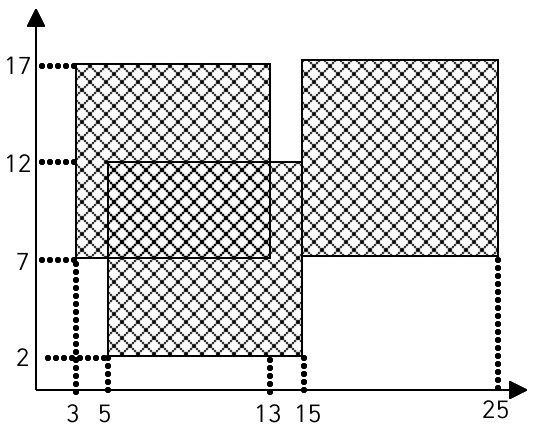

# 색종이

## 목차

1. 문제 주소 : `https://www.acmicpc.net/problem/2563`
2. [문제 시작](#문제)
3. [해결방안](#해결방안)
4. [2차원 배열 목차돌아가기](../README.md)
___

### [해당 코드](./색종이.java)

## 문제
가로, 세로의 크기가 각각 100인 정사각형 모양의 흰색 도화지가 있다. 
이 도화지 위에 가로, 세로의 크기가 각각 10인 정사각형 모양의 검은색 색종이를 색종이의 변과 도화지의 변이 평행하도록 붙인다. 
이러한 방식으로 색종이를 한 장 또는 여러 장 붙인 후 색종이가 붙은 검은 영역의 넓이를 구하는 프로그램을 작성하시오.

예를 들어 흰색 도화지 위에 세 장의 검은색 색종이를 그림과 같은 모양으로 붙였다면 검은색 영역의 넓이는 260이 된다.

___

## 입력

첫째 줄에 색종이의 수가 주어진다. 이어 둘째 줄부터 한 줄에 하나씩 색종이를 붙인 위치가 주어진다. 
색종이를 붙인 위치는 두 개의 자연수로 주어지는데 첫 번째 자연수는 색종이의 왼쪽 변과 도화지의 왼쪽 변 사이의 거리이고, 
두 번째 자연수는 색종이의 아래쪽 변과 도화지의 아래쪽 변 사이의 거리이다. 
색종이의 수는 100 이하이며, 색종이가 도화지 밖으로 나가는 경우는 없다
___
## 출력

첫째 줄에 색종이가 붙은 검은 영역의 넓이를 출력한다.
___

## 예제 입력 1

3  
3 7  
15 7  
5 2

---

## 해결방안
**1.입력된 크기의 공간만큼 체크 작업해준다.**  
**2.체크된 공간을 다 더해주면 크기가 나온다.**  

[맨위로 이동하기](#색종이)