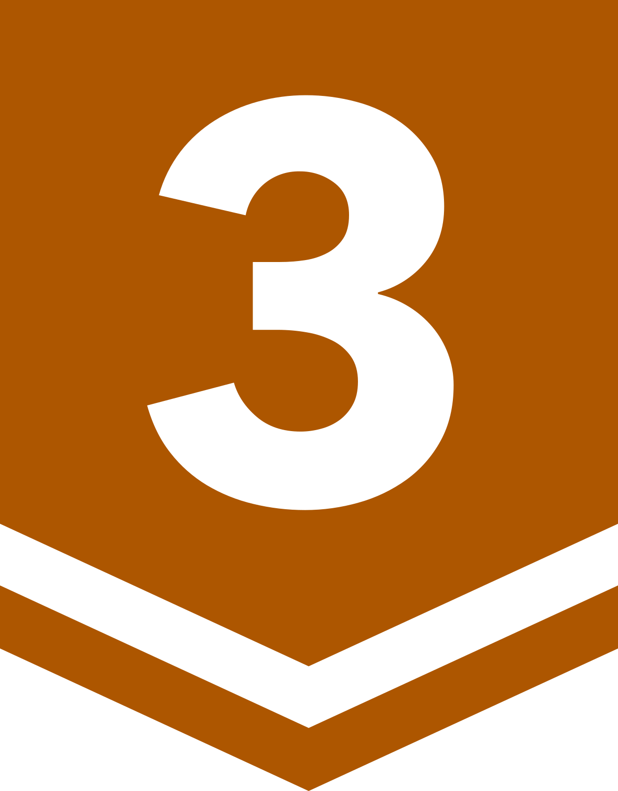

# 9단계 약수,배수와 소수

### [백준 알고리즘 목차 돌아가기](../README.md)

1. [배수와 약수](./배수와약수/README.md) - 
2. [약수 구하기](./약수구하기/README.md) - 
3. [약수들의 합](./약수들의합/README.md)  - 
4. [소수 찾기](./소수찾기/README.md) - 
5. [소수](./소수/README.md) - 
6. [소인수분해](./소인수분해/README.md) - 